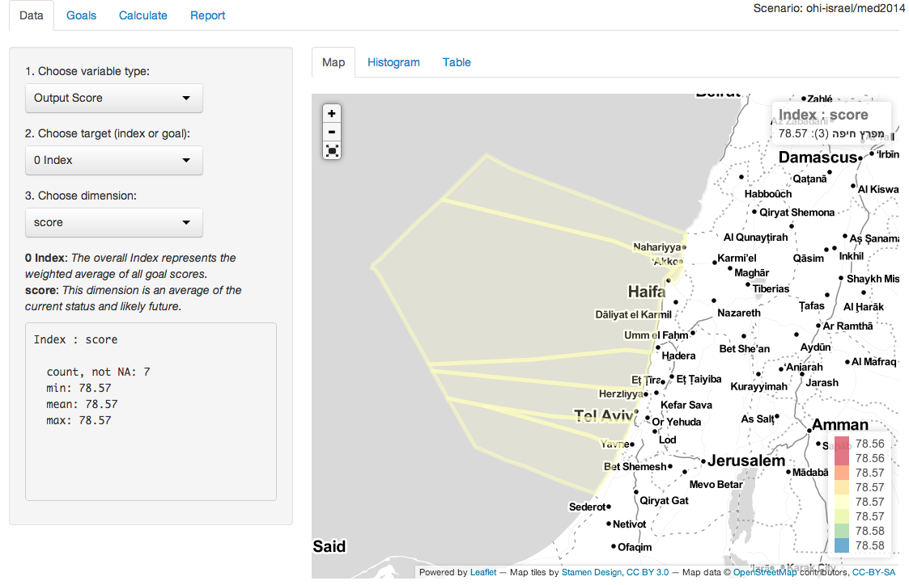

ohi-israel: Israel's Ocean Health Index
==========

To get the latest Ocean Health Index toolbox and Israel scenario files, run the following:

```r
# remove old packages
for (p in c('ohicore','ohigui','rCharts')){  
  if (p %in% rownames(installed.packages())){
    lib = subset(as.data.frame(installed.packages()), Package==p, LibPath, drop=T)
    remove.packages(p, lib)  
  }
}
 
# install dependencies
for (p in c('devtools')){
  if (!require(p, character.only=T)){
    install.packages(p)
    require(p, character.only=T)
  }
}
 
# install github packages
install_github('ropensci/git2r')
install_github('ohi-science/rCharts')

# clone packages in development from github
# (after install, can use git pull to get latest, even from RStudio)
library(git2r)
for (p in c('ohicore','ohi-israel')){

  # paths
  dir = normalizePath(sprintf('~/github/%s', p))
  url = sprintf('https://github.com/ohi-science/%s', p)
  
  # delete existing
  if (file.exists(dir)) unlink(dir, recursive=T, force=T)
  
  # clone
  dir.create(dir, recursive=T)
  repo = clone(url, dir)
}

# install ohicore into default R library path from local github cloned repo
install('~/github/ohicore')

# write launch_app shortcuts specific to R install path and operating system (OS)
scenario = '~/github/ohi-israel/med2014'
load_all('~/github/ohicore')
write_shortcuts(scenario)

# launch app (can use launch_app.* from inside scenario folder to launch in future)
launch_app(scenario)
```

The scenario files can be found here:

https://github.com/bbest/ohi-israel

As long as the ohicore library is installed (see [Install](http://ohi-science.org/pages/install.html)), 2x-clicking on the appropriate launchApp (.bat for Windows, .command for Mac) should open the toolbox with Israel layers loaded to look like this:



## Regions
The 4 regions and ancillary buffers (eg offshore3nm, inland1km) were created at: 

https://github.com/ohi-science/ohiprep/tree/master/Israel/Hamaarag-Regions_v2014a

## Layers
So far, this is just a straight copy of the OHI Global2013 layers extracting just for Israel and replicating per region (n=4). So there's no differentiation yet between regions since they all have the same value.

The easy next step to gain differentiation between regions is extracting the detailed pressure rasters (a la [Halpern et al 2008 Impacts](http://www.nceas.ucsb.edu/globalmarine/impacts)).

It's also worth noting that the following layers are empty (ie no data available for Israel in the original Global2013 data):
- pressures
  +  fp_art_hb
  +  fp_targetharvest
  +  hd_subtidal_hb
- resilience
  +  msi_gov
- LIV
  +  le_wage_cur_adj_value
  +  le_wage_cur_base_value
  +  le_wage_ref_adj_value
  +  le_wage_ref_base_value

## Functions
The following functions had to be customized from the Global2013:
- LIV_ECO: Israel has no wages data so LIV is just based on jobs. Removed missing regions addendum from 2013 global and georegional gapfilling.
- TR: skipped georegional gapfilling and assigning NA to uninhabitated islands

## More
Please visit t
