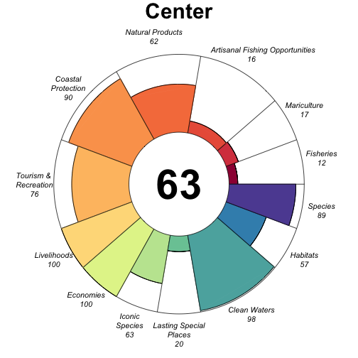
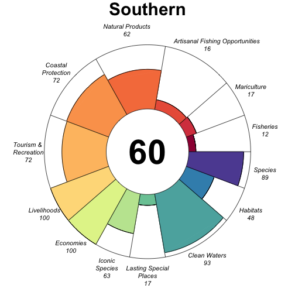
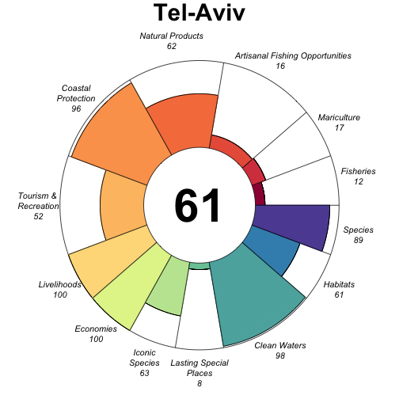

# Ocean Health Index Report

## GLOBAL (0)

### Flower

### Scores

|                                |  score| status| future|
|:-------------------------------|------:|------:|------:|
|Index                           |  56.55|     NA|  58.61|
|Food Provision                  |  15.77|  14.70|  16.85|
|. Fisheries                     |  16.03|  15.00|  17.05|
|. Mariculture                   |  14.88|  13.63|  16.13|
|Artisanal Fishing Opportunity   |  24.74|  23.33|  26.15|
|Natural Products                |    NaN|  46.27|    NaN|
|Coastal Protection              |    NaN|  50.44|    NaN|
|Tourism & Recreation            |  36.58|  34.75|  38.40|
|Coastal Livelihoods & Economies |  99.86|  99.73| 100.00|
|. Livelihoods                   |  99.73|  99.46| 100.00|
|. Economies                     | 100.00| 100.00| 100.00|
|Sense of Place                  |  43.06|  39.75|  46.37|
|. Iconic Species                |  42.33|  46.00|  38.67|
|. Lasting Special Places        |  43.78|  33.49|  54.08|
|Clean Waters                    |  77.25|  71.01|  83.50|
|Biodiversity                    |  94.83|  94.51|  95.16|
|. Habitats                      |  99.19|  98.37| 100.00|
|. Species                       |  90.48|  90.65|  90.32|

## Center (4)

### Flower

### Scores

|                                |  score| status| future| trend| pressures| resilience|
|:-------------------------------|------:|------:|------:|-----:|---------:|----------:|
|Index                           |  54.74|     NA|  56.74|    NA|        NA|         NA|
|Food Provision                  |  15.77|  14.70|  16.85|  0.00|        NA|         NA|
|. Fisheries                     |  16.03|  15.00|  17.05|  0.00|     22.64|      64.11|
|. Mariculture                   |  14.88|  13.63|  16.13|  0.01|     24.85|      78.86|
|Artisanal Fishing Opportunity   |  24.74|  23.33|  26.15| -0.03|     21.58|      64.25|
|Natural Products                |    NaN|  46.27|    NaN|  0.06|       NaN|      61.88|
|Coastal Protection              |    NaN|  50.44|    NaN|  0.00|       NaN|      61.22|
|Tourism & Recreation            |  27.67|  26.22|  29.11|  0.00|     48.28|      80.94|
|Coastal Livelihoods & Economies |  99.86|  99.73| 100.00|  0.99|        NA|         NA|
|. Livelihoods                   |  99.73|  99.46| 100.00|  0.98|     48.28|      42.96|
|. Economies                     | 100.00| 100.00| 100.00|  1.00|     37.65|      64.44|
|Sense of Place                  |  43.06|  39.75|  46.37|  0.15|        NA|         NA|
|. Iconic Species                |  42.33|  46.00|  38.67| -0.43|     30.00|      68.71|
|. Lasting Special Places        |  43.78|  33.49|  54.08|  0.74|     38.34|      75.26|
|Clean Waters                    |  77.25|  71.01|  83.50|  0.17|     62.39|      80.94|
|Biodiversity                    |  94.86|  94.52|  95.19| -0.09|        NA|         NA|
|. Habitats                      |  99.19|  98.37| 100.00| -0.01|     20.70|      69.41|
|. Species                       |  90.53|  90.68|  90.38| -0.18|     30.45|      66.28|

## Haifa (2)

### Flower

### Scores

|                                |  score| status| future| trend| pressures| resilience|
|:-------------------------------|------:|------:|------:|-----:|---------:|----------:|
|Index                           |  56.28|     NA|  58.31|    NA|        NA|         NA|
|Food Provision                  |  15.77|  14.70|  16.85|  0.00|        NA|         NA|
|. Fisheries                     |  16.03|  15.00|  17.05|  0.00|     22.64|      64.11|
|. Mariculture                   |  14.88|  13.63|  16.13|  0.01|     24.85|      78.86|
|Artisanal Fishing Opportunity   |  24.74|  23.33|  26.15| -0.03|     21.58|      64.25|
|Natural Products                |    NaN|  46.27|    NaN|  0.06|       NaN|      61.88|
|Coastal Protection              |    NaN|  50.44|    NaN|  0.00|       NaN|      61.22|
|Tourism & Recreation            |  38.37|  36.67|  40.07| -0.02|     48.28|      80.94|
|Coastal Livelihoods & Economies |  99.86|  99.73| 100.00|  0.99|        NA|         NA|
|. Livelihoods                   |  99.73|  99.46| 100.00|  0.98|     48.28|      42.96|
|. Economies                     | 100.00| 100.00| 100.00|  1.00|     37.65|      64.44|
|Sense of Place                  |  43.06|  39.75|  46.37|  0.15|        NA|         NA|
|. Iconic Species                |  42.33|  46.00|  38.67| -0.43|     30.00|      68.71|
|. Lasting Special Places        |  43.78|  33.49|  54.08|  0.74|     38.34|      75.26|
|Clean Waters                    |  77.25|  71.01|  83.50|  0.17|     62.39|      80.94|
|Biodiversity                    |  94.90|  94.52|  95.27| -0.09|        NA|         NA|
|. Habitats                      |  99.19|  98.37| 100.00| -0.01|     20.70|      69.41|
|. Species                       |  90.61|  90.68|  90.53| -0.18|     30.45|      66.28|

## Haifa Bay (3)

### Flower

### Scores

|                                |  score| status| future| trend| pressures| resilience|
|:-------------------------------|------:|------:|------:|-----:|---------:|----------:|
|Index                           |  59.24|     NA|  61.32|    NA|        NA|         NA|
|Food Provision                  |  15.77|  14.70|  16.85|  0.00|        NA|         NA|
|. Fisheries                     |  16.03|  15.00|  17.05|  0.00|     22.64|      64.11|
|. Mariculture                   |  14.88|  13.63|  16.13|  0.01|     24.85|      78.86|
|Artisanal Fishing Opportunity   |  24.74|  23.33|  26.15| -0.03|     21.58|      64.25|
|Natural Products                |    NaN|  46.27|    NaN|  0.06|       NaN|      61.88|
|Coastal Protection              |    NaN|  50.44|    NaN|  0.00|       NaN|      61.22|
|Tourism & Recreation            |     NA|     NA|     NA|    NA|     48.28|      80.94|
|Coastal Livelihoods & Economies |  99.86|  99.73| 100.00|  0.99|        NA|         NA|
|. Livelihoods                   |  99.73|  99.46| 100.00|  0.98|     48.28|      42.96|
|. Economies                     | 100.00| 100.00| 100.00|  1.00|     37.65|      64.44|
|Sense of Place                  |  43.06|  39.75|  46.37|  0.15|        NA|         NA|
|. Iconic Species                |  42.33|  46.00|  38.67| -0.43|     30.00|      68.71|
|. Lasting Special Places        |  43.78|  33.49|  54.08|  0.74|     38.34|      75.26|
|Clean Waters                    |  77.25|  71.01|  83.50|  0.17|     62.39|      80.94|
|Biodiversity                    |  94.77|  94.48|  95.06| -0.10|        NA|         NA|
|. Habitats                      |  99.19|  98.37| 100.00| -0.01|     20.70|      69.41|
|. Species                       |  90.36|  90.60|  90.12| -0.18|     30.45|      66.28|

## Northern (5)

### Flower

### Scores

|                                |  score| status| future| trend| pressures| resilience|
|:-------------------------------|------:|------:|------:|-----:|---------:|----------:|
|Index                           |  56.35|     NA|  58.44|    NA|        NA|         NA|
|Food Provision                  |  15.77|  14.70|  16.85|  0.00|        NA|         NA|
|. Fisheries                     |  16.03|  15.00|  17.05|  0.00|     22.64|      64.11|
|. Mariculture                   |  14.88|  13.63|  16.13|  0.01|     24.85|      78.86|
|Artisanal Fishing Opportunity   |  24.74|  23.33|  26.15| -0.03|     21.58|      64.25|
|Natural Products                |    NaN|  46.27|    NaN|  0.06|       NaN|      61.88|
|Coastal Protection              |    NaN|  50.44|    NaN|  0.00|       NaN|      61.22|
|Tourism & Recreation            |  38.88|  36.81|  40.94|  0.01|     48.28|      80.94|
|Coastal Livelihoods & Economies |  99.86|  99.73| 100.00|  0.99|        NA|         NA|
|. Livelihoods                   |  99.73|  99.46| 100.00|  0.98|     48.28|      42.96|
|. Economies                     | 100.00| 100.00| 100.00|  1.00|     37.65|      64.44|
|Sense of Place                  |  43.06|  39.75|  46.37|  0.15|        NA|         NA|
|. Iconic Species                |  42.33|  46.00|  38.67| -0.43|     30.00|      68.71|
|. Lasting Special Places        |  43.78|  33.49|  54.08|  0.74|     38.34|      75.26|
|Clean Waters                    |  77.25|  71.01|  83.50|  0.17|     62.39|      80.94|
|Biodiversity                    |  94.88|  94.50|  95.25| -0.09|        NA|         NA|
|. Habitats                      |  99.19|  98.37| 100.00| -0.01|     20.70|      69.41|
|. Species                       |  90.57|  90.64|  90.49| -0.18|     30.45|      66.28|

## Southern (1)

### Flower

### Scores

|                                |  score| status| future| trend| pressures| resilience|
|:-------------------------------|------:|------:|------:|-----:|---------:|----------:|
|Index                           |  56.35|     NA|  58.45|    NA|        NA|         NA|
|Food Provision                  |  15.77|  14.70|  16.85|  0.00|        NA|         NA|
|. Fisheries                     |  16.03|  15.00|  17.05|  0.00|     22.64|      64.11|
|. Mariculture                   |  14.88|  13.63|  16.13|  0.01|     24.85|      78.86|
|Artisanal Fishing Opportunity   |  24.74|  23.33|  26.15| -0.03|     21.58|      64.25|
|Natural Products                |    NaN|  46.27|    NaN|  0.06|       NaN|      61.88|
|Coastal Protection              |    NaN|  50.44|    NaN|  0.00|       NaN|      61.22|
|Tourism & Recreation            |  39.02|  36.75|  41.30|  0.02|     48.28|      80.94|
|Coastal Livelihoods & Economies |  99.86|  99.73| 100.00|  0.99|        NA|         NA|
|. Livelihoods                   |  99.73|  99.46| 100.00|  0.98|     48.28|      42.96|
|. Economies                     | 100.00| 100.00| 100.00|  1.00|     37.65|      64.44|
|Sense of Place                  |  43.06|  39.75|  46.37|  0.15|        NA|         NA|
|. Iconic Species                |  42.33|  46.00|  38.67| -0.43|     30.00|      68.71|
|. Lasting Special Places        |  43.78|  33.49|  54.08|  0.74|     38.34|      75.26|
|Clean Waters                    |  77.25|  71.01|  83.50|  0.17|     62.39|      80.94|
|Biodiversity                    |  94.75|  94.50|  95.00| -0.10|        NA|         NA|
|. Habitats                      |  99.19|  98.37| 100.00| -0.01|     20.70|      69.41|
|. Species                       |  90.32|  90.64|  90.00| -0.19|     30.45|      66.28|

## Tel-Aviv (6)

### Flower

### Scores

|                                |  score| status| future| trend| pressures| resilience|
|:-------------------------------|------:|------:|------:|-----:|---------:|----------:|
|Index                           |  56.36|     NA|  58.38|    NA|        NA|         NA|
|Food Provision                  |  15.77|  14.70|  16.85|  0.00|        NA|         NA|
|. Fisheries                     |  16.03|  15.00|  17.05|  0.00|     22.64|      64.11|
|. Mariculture                   |  14.88|  13.63|  16.13|  0.01|     24.85|      78.86|
|Artisanal Fishing Opportunity   |  24.74|  23.33|  26.15| -0.03|     21.58|      64.25|
|Natural Products                |    NaN|  46.27|    NaN|  0.06|       NaN|      61.88|
|Coastal Protection              |    NaN|  50.44|    NaN|  0.00|       NaN|      61.22|
|Tourism & Recreation            |  38.95|  37.30|  40.60| -0.03|     48.28|      80.94|
|Coastal Livelihoods & Economies |  99.86|  99.73| 100.00|  0.99|        NA|         NA|
|. Livelihoods                   |  99.73|  99.46| 100.00|  0.98|     48.28|      42.96|
|. Economies                     | 100.00| 100.00| 100.00|  1.00|     37.65|      64.44|
|Sense of Place                  |  43.06|  39.75|  46.37|  0.15|        NA|         NA|
|. Iconic Species                |  42.33|  46.00|  38.67| -0.43|     30.00|      68.71|
|. Lasting Special Places        |  43.78|  33.49|  54.08|  0.74|     38.34|      75.26|
|Clean Waters                    |  77.25|  71.01|  83.50|  0.17|     62.39|      80.94|
|Biodiversity                    |  94.86|  94.52|  95.19| -0.09|        NA|         NA|
|. Habitats                      |  99.19|  98.37| 100.00| -0.01|     20.70|      69.41|
|. Species                       |  90.53|  90.68|  90.38| -0.18|     30.45|      66.28|
